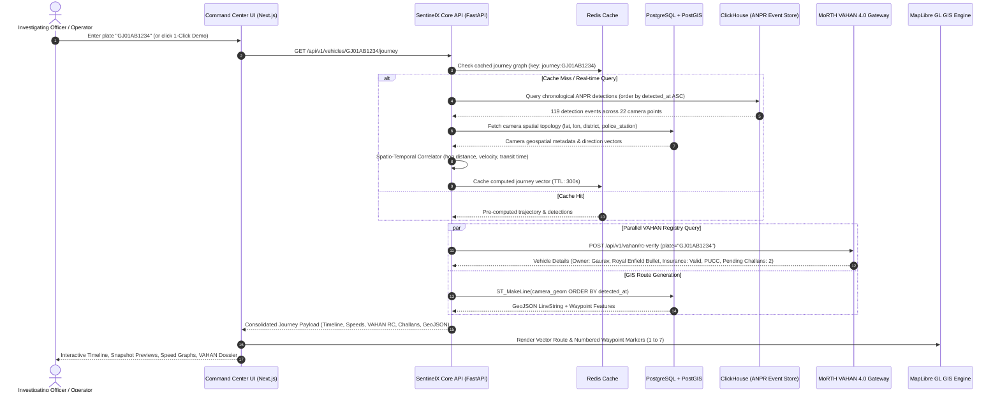
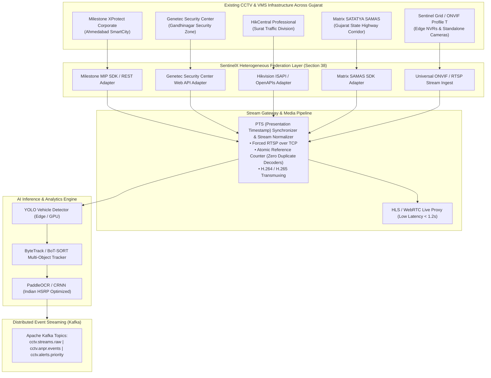
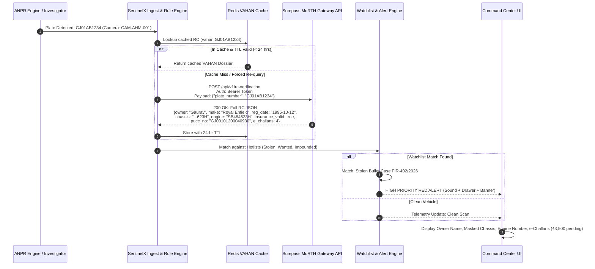
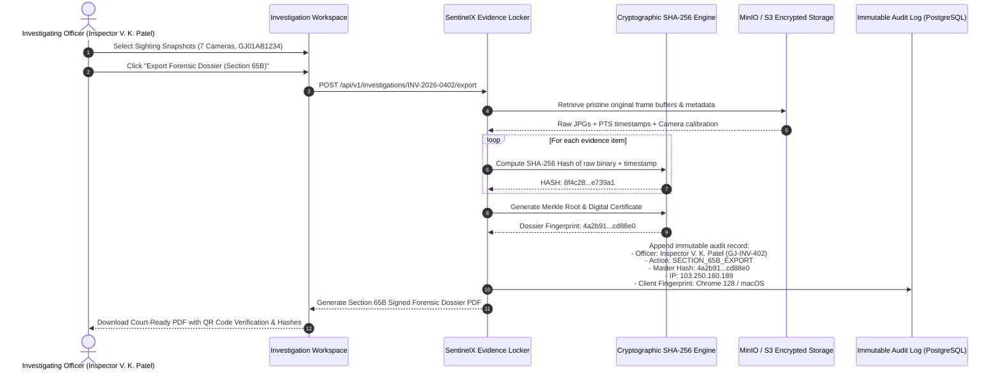
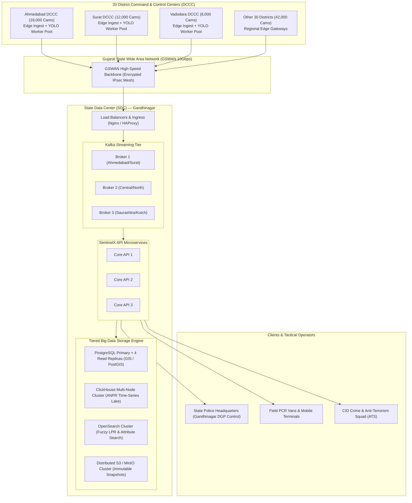

# GUJARAT SENTINELX: Workflow & Integration Diagrams
**Project:** Gujarat CCTV Hackathon 2026  
**System:** Gujarat SentinelX — Statewide CCTV Intelligence & Vehicle Journey Reconstruction Platform  
**Target:** 80,000 Heterogeneous Cameras across 33 Districts  
**Authority:** Government of Gujarat — Home Department & Gujarat Police  

---

## 1. End-to-End Vehicle Journey Reconstruction Workflow

This workflow illustrates how a query for vehicle registration `GJ01AB1234` reconstructs the cross-camera timeline, computes spatial travel vectors, queries the national vehicle registry, and compiles the forensic dossier in under 1 second.



---

## 2. Heterogeneous VMS Adapter & Federation Pipeline

SentinelX acts as a vendor-agnostic intelligence overlay without requiring "rip-and-replace" of existing infrastructure across municipal corporations, police command rooms, and highway concessions.



---

## 3. MoRTH VAHAN 4.0 Surepass National Registry Integration Flow

Illustrates how SentinelX validates vehicle identity, flags stolen vehicles, cross-checks RC chassis/engine numbers, and extracts traffic violation histories directly from the National Register of Motor Vehicles.



---

## 4. Real-Time Watchlist Detection & Alert Dispatch Workflow

Demonstrates instantaneous threat detection, role-based alert dispatching, and auditor-compliant officer acknowledgment workflows.

```mermaid
flowchart TD
    A[CCTV Frame Decoded at Edge / Gateway] --> B[AI Pipeline Localizes License Plate: GJ01AB1234]
    B --> C{Watchlist In-Memory Evaluator}
    
    C -->|No Match| D[Write to ClickHouse Analytics Lake]
    
    C -->|MATCH FOUND| E[Classify Alert Severity & Priority Tier]
    
    E --> F1[TIER 1: HIGH - Red Alert<br/>Stolen Vehicle / Terror Suspect / Hit & Run]
    E --> F2[TIER 2: MEDIUM - Amber Alert<br/>Expired Registration / Suspicious Cluster]
    E --> F3[TIER 3: LOW - Yellow Alert<br/>Unpaid e-Challan / Speed Advisory]

    F1 --> G[Broadcast via WebSocket & Server-Sent Events (SSE)]
    F2 --> G
    F3 --> G

    G --> H[Command Center Video Wall Flash Banner]
    G --> I[Investigator Audio Chime & Active Alert Drawer]
    G --> J[SMS / Police Wireless Notification to Nearest PCR Van]

    I --> K[Officer Inspects Alert Card: Vehicle, Camera, Snapshot, GPS]
    K --> L[Officer Clicks 'Acknowledge' with Operational Notes]
    L --> M[Cryptographic Audit Trail Written: Section 65B SHA-256 Stamp]
    M --> N[Alert Transitioned from 'NEW' to 'ACKNOWLEDGED']
```

---

## 5. Section 65B Digital Evidence Chain-of-Custody Hashing Workflow

Guarantees full evidentiary admissibility in Indian courts under **Section 65B of the Indian Evidence Act (Bharatiya Sakshya Adhiniyam, 2023)**.



---

## 6. Statewide Scalability Deployment Topology (80,000 Cameras)


